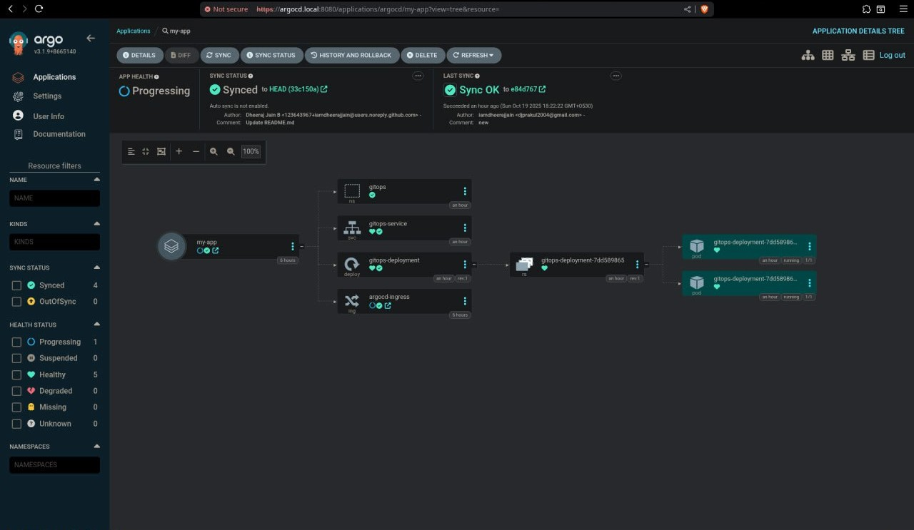
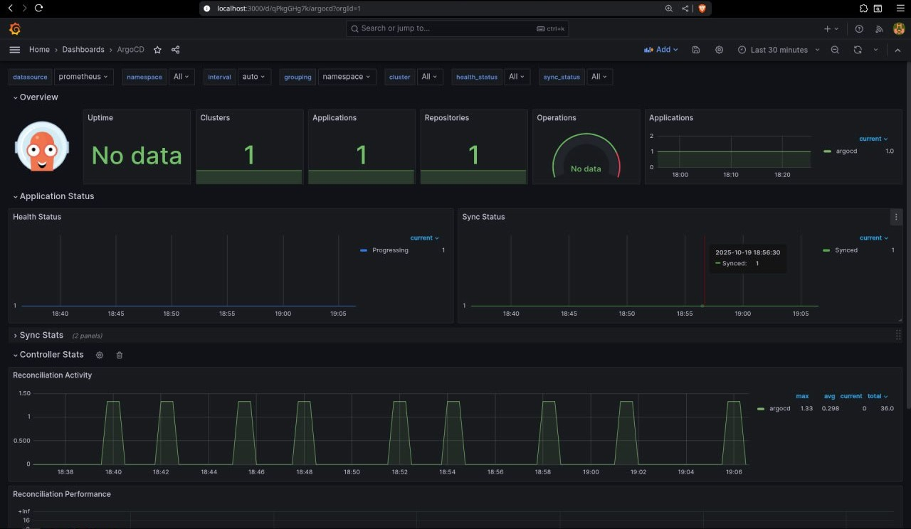
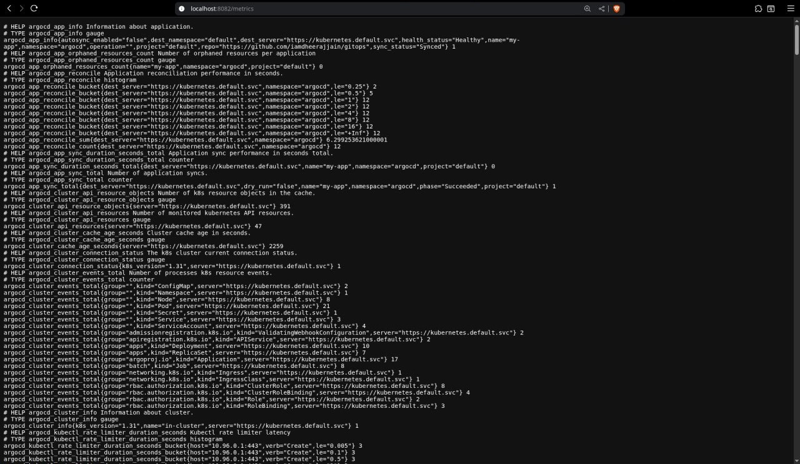

# 🚀 GitOps with ArgoCD, Prometheus, Grafana, and Kind


---

## 🧠 Overview

**GitOps** is a modern approach to Continuous Delivery where your **Git repository acts as the single source of truth** for your infrastructure and applications.  
This project demonstrates a complete **GitOps workflow**

---

## 🧩 Tech Stack

| Tool | Purpose |
|------|---------|
| Kind | Local Kubernetes cluster |
| ArgoCD | GitOps & CD Automation |
| Prometheus | Metrics collection |
| Grafana | Visualization & Dashboards |
| NGINX Ingress | External access routing | 

---

## ⚙️ Architecture

              ┌──────────────────────────────┐
              │        GitHub Repo           │
              │ (manifests/, deployments/)   │
              └──────────────┬───────────────┘
                             │
                             ▼
                   ┌────────────────────┐
                   │     ArgoCD         │
                   │ Syncs manifests    │
                   │  from GitHub repo  │
                   └────────┬───────────┘
                            │
                            ▼
               ┌────────────────────────── ┐
               │   Kind Kubernetes Cluster │
               │   (Deployed Application)  │
               └─────────────────────────  ┘
                            │
                            ▼
          ┌──────────────────────────────────── ┐
          │     Prometheus + Grafana Stack      │
          │  Metrics, Dashboards, Visualization │
          └──────────────────────────────────── ┘

          
---

## 🧰 Prerequisites

Before running this project, ensure you have the following installed:

- 🐳 **Docker** → [Install Docker](https://docs.docker.com/get-docker/)
- ⚙️ **Kind** → [Install Kind](https://kind.sigs.k8s.io/)
- ☸️ **kubectl** → [Install kubectl](https://kubernetes.io/docs/tasks/tools/)
- 🚀 **ArgoCD CLI** → [Install ArgoCD CLI](https://argo-cd.readthedocs.io/en/stable/cli_installation/)
- 📊 **Prometheus & Grafana** (optional for system monitoring)

---

# 🚀 Setup Instructions

## 1️⃣ Create a Kind Cluster
```bash
kind create cluster --name gitops
```

## 2️⃣ Install ArgoCD

Create the ArgoCD namespace:
```bash
kubectl create namespace argocd
```

Install ArgoCD:
```bash
kubectl apply -n argocd -f https://raw.githubusercontent.com/argoproj/argo-cd/stable/manifests/install.yaml
```

Verify the installation:
```bash
kubectl get pods -n argocd
```

## 3️⃣ Access ArgoCD UI

Port forward to access the ArgoCD server:
```bash
kubectl port-forward svc/argocd-server -n argocd 8080:443
```

Get the initial admin password:
```bash
kubectl get secret argocd-initial-admin-secret -n argocd -o jsonpath="{.data.password}" | base64 -d
```

## 4️⃣ Login to ArgoCD CLI
```bash
argocd login localhost:8080 --username admin --password <your-password> --insecure
```

## 5️⃣ Create GitOps Application
```bash
argocd app create gitops \
  --repo https://github.com/iamdheerajjain/gitops.git \
  --path manifests \
  --dest-server https://kubernetes.default.svc \
  --dest-namespace gitops
```

## 6️⃣ Sync the Application
```bash
argocd app sync gitops
```

---

## 📝 Notes

- Make sure you have `kind`, `kubectl`, and `argocd` CLI tools installed
- Replace `<your-password>` with the actual password retrieved in step 3
- The ArgoCD UI will be available at `https://localhost:8080`

---

# 📡 Access Your Application

You can expose the app in one of two ways:

## ➤ Option 1: Port Forwarding
```bash
kubectl port-forward svc/gitops-service 9090:80 -n gitops
```

Then open: http://localhost:9090

## ➤ Option 2: Using Ingress

If using NGINX ingress:
```bash
kubectl apply -f manifests/ingress.yaml
```

Add this line to `/etc/hosts`:
```bash
127.0.0.1 app.local
```

Now open http://app.local

---

# 📈 Monitoring Setup

## 🔸 Prometheus

Prometheus scrapes metrics from your cluster and ArgoCD components:
```bash
sudo systemctl start prometheus
sudo systemctl enable prometheus
```

Access Prometheus at: http://localhost:9090

## 🔸 Grafana

Grafana visualizes metrics collected by Prometheus:
```bash
sudo systemctl start grafana-server
sudo systemctl enable grafana-server
```

Access Grafana at: http://localhost:3000

**Default credentials:**
- Username: `admin`
- Password: `admin`

You can change these in `/etc/grafana/grafana.ini`

---

## Sample Results


---

---



